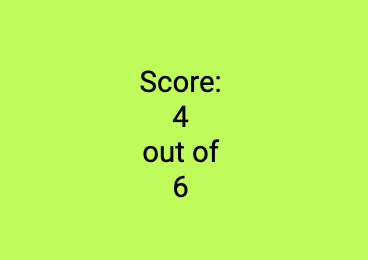

# CDMX Quiz, Mexico City Quiz

This is a quiz about Mexico City for everybody who would like to get some information about Mexico City. I've been living in Mexico City and I like many places there. Besides that there is a big community for foreigners and expats there. This quiz is good for those who would like to go to Mexico City or maybe already moved there and would like to get some tips. Mexico City is called CDMX, so I used it as a name of the project to make it short. 

CDMX Quiz is a project using JavaScript, HTML and CSS. In this project there are 6 questions. When the user answers the question correctly, the button turns green, when the user answers incorrectly, the button turns red. I also chose brand colors, you can read more about Project Brand color below and see the images. 

## Features

I'll describe my project more in detail for you. Mexico is a very colorful country, so I used bright colors to make this brand design and to highlight the logo, Mexican flag, on the bright green yellow background. Especially rose-magenta colors, for example, there are buildings of these colors. It also reminds me of bugambilia flowers in Mexico.

### Existing Features

- __The CDMX Quiz Logo and Heading__

  - The logo is on the left at the top of the page, it's a Mexican flag, so everyone who knows it, will recognize it. I made it round, because I wanted to have a round logo. I used a Mexican flag on purpose so that it's clear at first sight that this is a project about Mexico. The heading is centered, the same as the quiz below to make everything more harmonious and user-friendly. 

- __The Game Area__

  - This section where the user answers the quiz questions. The user will click an answer and if it's correct it will turn green, if it's incorrect it will turn red.
  - The user will get 1 score for each correct answer. At the end of the game the user will get an alert message with the total number of scores the user got for the quiz. 

- __The Question section__

  - The question section is where the user will read the questions. There are 6 questions. There are 4 answer buttons for each question 
  - The user can click on a button with an answer, that the user chooses. A correct answer button will turn green, the incorrect answer button will turn red when clicked. 

- __The Score Area__

  - This section will show the number of correct answers and the number of questions answered to the user.

### Features Left to Implement

- It's always possible to experiment with more features. 

## Testing

In this section, you need to convince the assessor that you have conducted enough testing to legitimately believe that the site works well. Essentially, in this part you will want to go over all of your project’s features and ensure that they all work as intended, with the project providing an easy and straightforward way for the users to achieve their goals.

In addition, you should mention in this section how your project looks and works on different browsers and screen sizes.

You should also mention in this section any interesting bugs or problems you discovered during your testing, even if you haven't addressed them yet.

If this section grows too long, you may want to split it off into a separate file and link to it from here.

### Validator Testing

- HTML
  - No errors were returned when passing through the official [W3C validator](https://validator.w3.org/nu/?doc=https%3A%2F%2Fcode-institute-org.github.io%2Flove-maths%2F)
- CSS
  - No errors were found when passing through the official [(Jigsaw) validator](https://jigsaw.w3.org/css-validator/validator?uri=https%3A%2F%2Fvalidator.w3.org%2Fnu%2F%3Fdoc%3Dhttps%253A%252F%252Fcode-institute-org.github.io%252Flove-maths%252F&profile=css3svg&usermedium=all&warning=1&vextwarning=&lang=en)
- JavaScript
  - No errors were found when passing through the official [Jshint validator](https://jshint.com/)
    - The following metrics were returned:
    - There are 11 functions in this file.
    - Function with the largest signature takes 2 arguments, while the median is 0.
    - Largest function has 10 statements in it, while the median is 3.
    - The most complex function has a cyclomatic complexity value of 4 while the median is 2.

### Unfixed Bugs

You will need to mention unfixed bugs and why they were not fixed. This section should include shortcomings of the frameworks or technologies used. Although time can be a big variable to consider, paucity of time and difficulty understanding implementation is not a valid reason to leave bugs unfixed.

## Deployment

This section should describe the process you went through to deploy the project to a hosting platform (e.g. GitHub)

- The site was deployed to GitHub pages. The steps to deploy are as follows:
  - In the GitHub repository, navigate to the Settings tab
  - From the source section drop-down menu, select the Master Branch
  - Once the master branch has been selected, the page will be automatically refreshed with a detailed ribbon display to indicate the successful deployment.

The live link can be found here - <https://code-institute-org.github.io/love-maths/>

## Credits

In this section you need to reference where you got your content, media and extra help from. It is common practice to use code from other repositories and tutorials, however, it is important to be very specific about these sources to avoid plagiarism.

You can break the credits section up into Content and Media, depending on what you have included in your project.

### Content

- The text for the Home page was taken from Wikipedia Article A
- Instructions on how to implement form validation on the Sign Up page was taken from [Specific YouTube Tutorial](https://www.youtube.com/)
- The icons in the footer were taken from [Font Awesome](https://fontawesome.com/)

### Media

- The photos used on the home and sign up page are from This Open Source site
- The images used for the gallery page were taken from this other open source site

Congratulations on completing your Readme, you have made another big stride in the direction of being a developer!

## Other General Project Advice

Below you will find a couple of extra tips that may be helpful when completing your project. Remember that each of these projects will become part of your final portfolio so it’s important to allow enough time to showcase your best work!

- One of the most basic elements of keeping a healthy commit history is with the commit message. When getting started with your project, read through [this article](https://chris.beams.io/posts/git-commit/) by Chris Beams on How to Write  a Git Commit Message
  - Make sure to keep the messages in the imperative mood

- When naming the files in your project directory, make sure to consider meaningful naming of files, point to specific names and sections of content.
  - For example, instead of naming an image used ‘image1.png’ consider naming it ‘landing_page_img.png’. This will ensure that there are clear file paths kept.

- Do some extra research on good and bad coding practices, there are a handful of useful articles to read, consider reviewing the following list when getting started:
  - [Writing Your Best Code](https://learn.shayhowe.com/html-css/writing-your-best-code/)
  - [HTML & CSS Coding Best Practices](https://medium.com/@inceptiondj.info/html-css-coding-best-practice-fadb9870a00f)
  - [Google HTML/CSS Style Guide](https://google.github.io/styleguide/htmlcssguide.html#General)

Getting started with your Portfolio Projects can be daunting, planning your project can make it a lot easier to tackle, take small steps to reach the final outcome and enjoy the process!
