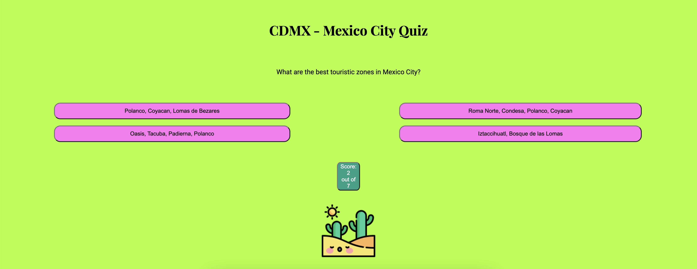
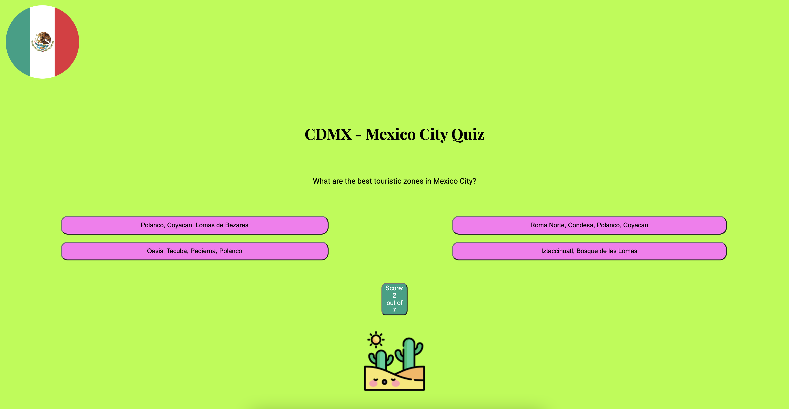

# CDMX Quiz, Mexico City Quiz

This is a quiz about Mexico City for everybody who would like to get some information about Mexico City. I've been living in Mexico City and I like many places there. Besides that there is a big community for foreigners and expats there. This quiz is good for those who would like to go to Mexico City or maybe already moved there and would like to get some tips. Mexico City is called CDMX, so I used it as a name of the project to make it short. 

CDMX Quiz is a project using JavaScript, HTML and CSS. In this project there are 6 questions. When the user answers the question correctly, the button turns green, when the user answers incorrectly, the button turns red. I also chose brand colors, you can read more about Project Brand color below and see the images. 

## Features

I'll describe my project more in detail for you. Mexico is a very colorful country, so I used bright colors to make this brand design and to highlight the logo, Mexican flag, on the bright green yellow background. Especially rose-magenta colors, for example, there are buildings of these colors. It also reminds me of bugambilia flowers in Mexico.

### Existing Features

- __The CDMX Quiz Logo and Heading__

  - The logo is on the left at the top of the page, it's a Mexican flag, so everyone who knows it, will recognize it. I made it round, because I wanted to have a round logo. I used a Mexican flag on purpose so that it's clear at first sight that this is a project about Mexico. The heading is centered, the same as the quiz below to make everything more harmonious and user-friendly. 

- __The Game Area__

  - This section where the user answers the quiz questions. The user will click an answer and if it's correct it will turn green, if it's incorrect it will turn red.
  - The user will get 1 score for each correct answer. At the end of the game the user will get an alert message with the total number of scores the user got for the quiz. 

- __The Question section__

  - The question section is where the user will read the questions. There are 6 questions. There are 4 answer buttons for each question 
  - The user can click on a button with an answer, that the user chooses. A correct answer button will turn green, the incorrect answer button will turn red when clicked. 

- __The Score Area__

  - This section will show the number of correct answers and the number of questions answered to the user.

### Features Left to Implement

- It's always possible to experiment with more features. 

## Testing

I did different tests to make sure that the quiz project is user-friendly and easy to understand.

I added cursor pointer and hover color to the buttons, so that the user can see that he/she hovers and click the button and I used green color for correct answer and red color for incorrect answer when the user clicks the answer button. 

There is a score alert at the end of the game, where the user can see the score.

I checked the quiz on different devices. Here is an example of a mobile view:

Here is an iPad view as an example:

And a laptop example:

I've tried it in different browsers and it works well. 

I had to fix the bugs, when I was trying to change the button colors. The best idea was to change the text color to white when hovering. I also tried out some other colors. 

### Validator Testing

- HTML
  - No errors were returned when passing through the official [W3C validator](https://validator.w3.org/#validate_by_input)
- CSS
  - No errors were found when passing through the official [(Jigsaw) validator](https://jigsaw.w3.org/css-validator/)
- JavaScript
  - No errors were found when passing through the official [Jshint validator](https://jshint.com/)
    - The following metrics were returned:
    - There are 9 functions in this file.
    - Function with the largest signature take 2 arguments, while the median is 0.
    - Largest function has 10 statements in it, while the median is 2.
    - The most complex function has a cyclomatic complexity value of 2 while the median is 1.

### Unfixed Bugs

There are no unfixed bugs.

## Deployment

I used GitHub pages to deploy the project.

- The site was deployed to GitHub pages. The steps to deploy are as follows:
  - In the GitHub repository, navigate to the Settings tab
  - From the source section drop-down menu, select the Master Branch
  - Once the master branch has been selected, the page will be automatically refreshed with a detailed ribbon display to indicate the successful deployment.

The live link can be found here - <https://elenaramirezhdz.github.io/cdmx-quiz/>

## Credits

- I used this page to choose colors for the website: <https://www.computerhope.com/cgi-bin/htmlcolor.pl?c=FF7393>
- I learned from this Java Script tutorial by GreatStack <https://www.youtube.com/watch?v=PBcqGxrr9g8&ab_channel=GreatStack>
- I used a flaticon icon for my project logo <https://www.flaticon.com/free-icons/mexican>
- I used a Freepik cactus icon to place under the score button <https://de.freepik.com/icon/wueste_2055505>

### Content

- I wrote all the questions myself based on my knowledge and research some more zones in Mexico City in Google.
- I used a flaticon icon for my project logo <https://www.flaticon.com/free-icons/mexican>, also for a favicon.

### Media

- I used a flaticon icon for my project logo <https://www.flaticon.com/free-icons/mexican>, also for a favicon.
- I used a Freepik cactus icon to place under the score button <https://de.freepik.com/icon/wueste_2055505>
  