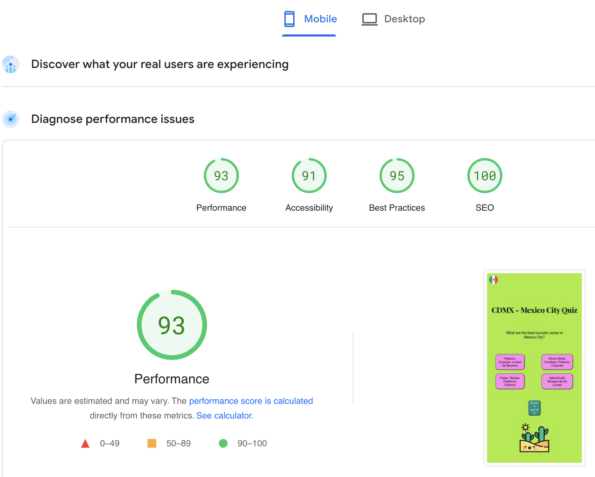

# CDMX Quiz -  Testing

Visit the deployed site: [CDMX Quiz](https://elenaramirezhdz.github.io/cdmx-quiz/)

- - -

## CONTENTS

- [CDMX Quiz -  Testing](#cdmx-quiz----testing)
  - [CONTENTS](#contents)
  - [AUTOMATED TESTING](#automated-testing)
    - [W3C Validator](#w3c-validator)
    - [JavaScript Validator](#javascript-validator)
    - [Lighthouse](#lighthouse)
    - [Desktop Results](#desktop-results)
    - [Mobile Results](#mobile-results)
  - [MANUAL TESTING](#manual-testing)
    - [Testing User Stories](#testing-user-stories)
    - [Full Testing](#full-testing)

I utilised Chrome developer tools to build this quiz site and to check my ideas and to see if they work.

I checked the resposive funcionality of my quiz site using Google Developer Tools to see how it works on different screen sizes and devices.

- - -

## AUTOMATED TESTING

### W3C Validator

[W3C](https://validator.w3.org/) was used to validate the HTML on all pages of the website. It was also used to validate the CSS.

* [index.html](testing/w3/w3-index.png) - Passed, though there was just one thing that I used a button for the score. I decided nevertheless to use my idea, because I like its look.

* [style.css](testing/w3/w3-css.png) - Passed, no errors found.

- - -

### JavaScript Validator

[script.js](https://jshint.com/) was used to validate the JavaScript. Passed. I got the following message: 
- There are 9 functions in this file.
- Function with the largest signature take 2 arguments, while the median is 0.
- Largest function has 10 statements in it, while the median is 2.
- The most complex function has a cyclomatic complexity value of 2 while the median is 1.

- - -

### Lighthouse

I used Lighthouse within the Chrome Developer Tools to test the performance, accessibility, best practices and SEO of the website.

### Desktop Results

Here are the results.

### Mobile Results

I checked the page on mobile and it had a high rating. <https://pagespeed.web.dev/>

- - -

## MANUAL TESTING

### Testing User Stories

`First Time Visitors`

| Goals | How are they achieved? |
| :--- | :--- |
| I want to do a quiz about Mexico City, CDMX so that the user can learn about some places there. | CDMX Quiz provides information about nice place places in Mexico City. |
| I want the site to be responsive to my device. | I made a responsive site. |
| I want the site to be easy to navigate. | I used questions and clickable buttons with the answers, I also used pointer cursor, it's easy for the user to click on the answer and if it's correct, it will be green and if it's incorrect, it will be red. There is a score board that shows the score.  |

`Returning Visitors`

|  Goals | How are they achieved? |
| :--- | :--- |
| I want to make it easy for the users to learn about some places in Mexico City. | Users can learn about nice places in Mexico City by answering the questions. |

`Frequent Visitors`

| Goals | How are they achieved? |
| :--- | :--- |
| I want this quiz to be easy to do for the users. | The users can do the quiz as many times as they want and remember the correct answers. |
| There are just 6 questions, so it won't be too much information for the user. | At the end of the quiz game the user can see the total number of scores in an alert message. |

- - -

### Full Testing

Full testing was performed on the following devices:

* Laptop:
  * Macbook Pro 2017 15 inch screen
* Mobile Devices:
  * iPhone 12 pro.
  * Galaxy Fold.
  * Samsung Galaxy A51/71.

Each device tested the site using the following browsers:

* Google Chrome
* Safari
* Firefox

`Home Page - Quiz page`

| Feature | Expected Outcome | Testing Performed | Result | Pass/Fail |
| --- | --- | --- | --- | --- |
| The h1 heading | The heading shows the topic of the quiz  | Opened the page and read its topic | It's easy to understand | Pass |
| Questions and answer buttons | The user can see a question and 4 answer options, there is a pointer cursor and the buttons with answers change colors when hovering, so it's easy to see that the user can click it. | Clicked on button | If the answer is correct,  it turns green, if the answer is incorrect, it turns red.  | Pass |
| Score board | Score board show the number of scores and questions answered| Clicked on answers and got scores | The user can see his/her score results after answering each question | Pass |
| Total score alert | At the end of the game the user gets an alert with the total score out of all 6 questions | Clicked through all the quesitons and got an alert with the result | GThe alert displays the score and the number of questions correctly | Pass |
| Quiz game restarts | After the quiz finished and an alert message is clicked, the quiz game start again| When I answer the questions from the beginning, there will be a new score counting | You can play the quiz game as many times as you like | Pass |
