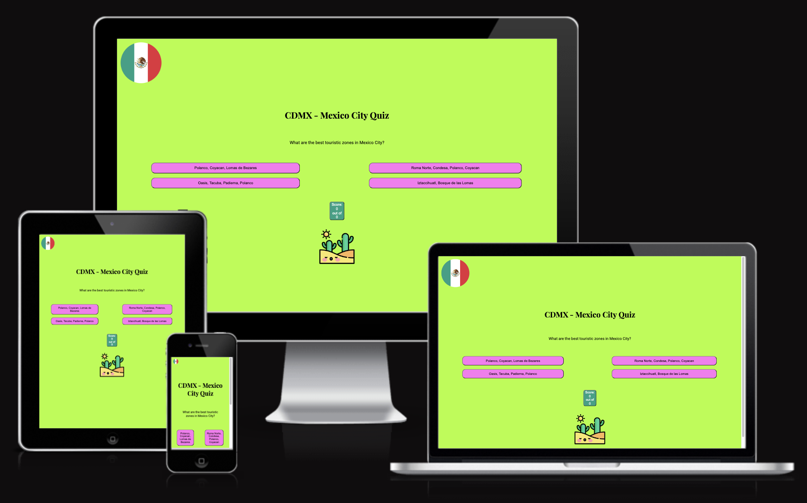

# CDMX Quiz -  Testing

Visit the deployed site: [CDMX Quiz](https://elenaramirezhdz.github.io/cdmx-quiz/)

- - -

## CONTENTS

- [CDMX Quiz -  Testing](#cdmx-quiz----testing)
  - [CONTENTS](#contents)
  - [AUTOMATED TESTING](#automated-testing)
    - [W3C Validator](#w3c-validator)
    - [JavaScript Validator](#javascript-validator)
    - [Lighthouse](#lighthouse)
    - [Desktop Results](#desktop-results)
    - [Mobile Results](#mobile-results)
  - [MANUAL TESTING](#manual-testing)
    - [Testing User Stories](#testing-user-stories)
    - [Full Testing](#full-testing)

I utilised Chrome developer tools to build this quiz site and to check my ideas and to see if they work.

I checked the resposive funcionality of my quiz site using Google Developer Tools to see how it works on different screen sizes and devices.

- - -

## AUTOMATED TESTING

### W3C Validator

[W3C](https://validator.w3.org/) was used to validate the HTML on all pages of the website. It was also used to validate the CSS.

* [index.html](testing/w3/w3-index.png) - Passed, though there was just one thing that I used a button for the score. I decided nevertheless to use my idea, because I like its look.

* [style.css](testing/w3/w3-css.png) - Passed, no errors found.

- - -

### JavaScript Validator

[script.js](https://jshint.com/) was used to validate the JavaScript. Passed. I got the following message: 
- There are 9 functions in this file.
- Function with the largest signature take 2 arguments, while the median is 0.
- Largest function has 10 statements in it, while the median is 2.
- The most complex function has a cyclomatic complexity value of 2 while the median is 1.

- - -

### Lighthouse

I used Lighthouse within the Chrome Developer Tools to test the performance, accessibility, best practices and SEO of the website.

### Desktop Results

Here are the results.

### Mobile Results

I checked the page on mobile and it had a high rating. <https://pagespeed.web.dev/>

- - -

## MANUAL TESTING

### Testing User Stories

`First Time Visitors`

| Goals | How are they achieved? |
| :--- | :--- |
| I want to do a quiz about Mexico City, CDMX so that the user can learn about some places there. | CDMX Quiz provides information about nice place places in Mexico City |
| I want the site to be responsive to my device. | I made a responsive site. |
| I want the site to be easy to navigate. | I used questions and clickable buttons with the answers, I also used pointer cursor, it's easy for the user to click on the answer and if it's correct, it will be green and if it's incorrect, it will be red. There is a score board that shows the score.  |

`Returning Visitors`

|  Goals | How are they achieved? |
| :--- | :--- |
| I want to make it easy for the users to learn about some places in Mexico City. | Users can learn about nice places in Mexico City by answering the questions. |

`Frequent Visitors`

| Goals | How are they achieved? |
| :--- | :--- |
| I want this quiz to be easy to do for the users. | The users can do the quiz as many times as they want and remember the correct answers. |
| There are just 6 questions, so it won't be too much information for the user. | At the end of the quiz game the user can see the total number of scores in an alert message. |

- - -

### Full Testing

Full testing was performed on the following devices:

* Laptop:
  * Macbook Pro 2021 14 inch screen
* Mobile Devices:
  * iPhone 13 pro.
  * iPhone 11 pro.
  * Phone X.

Each device tested the site using the following browsers:

* Google Chrome
* Safari
* Firefox

Additional testing was taken by friends and family on a variety of devices and screen sizes. They reported no issues when playing.

One tester in peer code review stated that the bottom of the play screen was cut off when testing on an iphone SE (2nd gen). I was unable to replicate this issue using google chrome developer tools.

`Home Page`

| Feature | Expected Outcome | Testing Performed | Result | Pass/Fail |
| --- | --- | --- | --- | --- |
| The Sites title | Link directs the user back to the home page | Clicked title | Home page reloads | Pass |
| How to play button | Displays the modal with the instructions on how to play the game | Clicked on button | Modal with instructions on how to play opens | Pass |
| Modal close button | Closes the modal | Clicked on close button | Modal closed | Pass |
| Play Button | Directs the user to the game page | Clicked on button | Game page opens to display the difficulty selections | Pass |
| High Scores Button | Directs the user to the high scores page | Clicked on button | Directs to the high scores page | Pass |
| All buttons - hover effect | All black buttons with white text should change to white with black text when hovered over. | Hover over each button on the page | Each button displayed the correct styling when hovered over | Pass |
| 🍺 Cursor | The 🍺 should display when a user moves the mouse over a button | Moved the mouse over each button to check the cursor changed upon entering the button | The cursor changed from the arrow cursor to the 🍺 cursor | Pass |

`Game Page - Difficulty Selection`

| Feature | Expected Outcome | Testing Performed | Result | Pass/Fail |
| --- | --- | --- | --- | --- |
| The Sites title | Link directs the user back to the home page | Clicked title | Directed back to home page | Pass |
| All buttons - hover effect | All buttons with a black background & white text should change when hovered over to a background colour of white with black text. | Hover over each button on the page | Each button displayed the correct styling when hovered over | Pass |
| 🍺 Cursor | The 🍺 should display when a user moves the mouse over a button | Moved the mouse over each button to check the cursor changed upon entering the button | The cursor changed from the arrow cursor to the 🍺 cursor | Pass |
| Easy Button | Calls the easy quiz URL for the API | By console logging the data called from the API I was able to check the difficulty level of the questions corresponded with the level called |  | Pass |
| Medium Button | Calls the medium quiz URL for the API | By console logging the data called from the API I was able to check the difficulty level of the questions corresponded with the level called |  | Pass |
| Hard Button | Calls the hard quiz URL for the API | By console logging the data called from the API I was able to check the difficulty level of the questions corresponded with the level called |  | Pass |

`Game Page - Quiz Area`

| Feature | Expected Outcome | Testing Performed | Result | Pass/Fail |
| --- | --- | --- | --- | --- |
| The Sites title | Link directs the user back to the home page | Clicked title | directed back to home page | Pass |
| All buttons - hover effect | All buttons with a black background & white text should change when hovered over to a background colour of white with black text. | Hover over each button on the page | Each button displayed the correct styling when hovered over | Pass |
| 🍺 Cursor | The 🍺 should display when a user moves the mouse over a button | Moved the mouse over each button to check the cursor changed upon entering the button | The cursor changed from the arrow cursor to the 🍺 cursor | Pass |
| Question populated | The question from the API is correctly pulled from the JSON data | console.log the data and check that the question has been pulled correctly | The question is displaying | Pass |
| Answers populated | The answers from the API are correctly pulled from the JSON data | console.log the data and check that the answers have been pulled correctly | The answers are displaying | Pass |
| Data attribute correct | The data attribute correct has been applied to the correct answer | By console logging the data I am able to check what the correct answer should be. I can then console.log the id of the buttons to check whether the data attribute has been applied only to the button containing the correct answer | only the correct answer has the correct attribute | Pass |
| Correct answer - border colour | When a correct answer is clicked the border around the game area should display green | Clicked on a correct answer | Border displayed green | Pass |
| Incorrect answer - border colour | When an incorrect answer is clicked the border around the game area should display red | Clicked incorrect answer | Border displayed red | Pass |
| Correct answer - button colour | When a correct answer is clicked the button should change background colour to green | Clicked a correct answer | Button background turned green | Pass |
| Incorrect answer - button colour | When an incorrect answer is clicked the clicked buttons background should turn red | Clicked incorrect answer | Button background turned red | Pass |
| Incorrect answer - display correct answer | When an incorrect answer is clicked, the correct answer should display a green background | Clicked incorrect answer | The correct answer turned green | Pass |
| Question No counter | The Question No counter should start at 1 and increase by 1 time the next button is selected. | answered questions and clicked next button | Each time the next button is clicked the Answer no counter increases by 1. | Pass |
| Score Counter | The score counter should begin at 0. Each time a correct answer is selected the score should increase by 10. If an incorrect answer is selected the score should remain the same | Clicked a correct answer to check if the score increased. Clicked an incorrect answer to check the score stayed the same| When a correct answer was selected the score increased by 10. When an incorrect score was selected the score stayed the same | Pass |
| Not Allowed Cursor | Once an answer has been selected, the answer buttons should then be disabled and when hovered over the not allowed cursor will display | Clicked on one answer button and then clicked on the remaining answer buttons | After the answer was selected each answer button clicked on subsequently displayed the not allowed cursor | Pass |
| Next button - becomes visible | When an answer is clicked the next button should be displayed so the user can progress to the next question, or to the end section if all 15 questions have been answered| Clicked on an answer button | The next button displayed | Pass |
| Next button hover effect | A button with a white background & black text should change to a button with a black background & white text when hovered over.| Hovered over the button | Style changed as expected | Pass |
| Next button - clicked | When clicked all answer styles should be removed, the next button should become hidden again and a new question and answer loaded if there are questions left. If all questions have been answered the end game should appear | Clicked on the next button | All styles were removed and a new question and answers were displayed. After question 15 was answered I was taken to the end game. | Pass |

`Game Page - End of Quiz`

| Feature | Expected Outcome | Testing Performed | Result | Pass/Fail |
| --- | --- | --- | --- | --- |
| The Sites title | Link directs the user back to the home page | Clicked title | Home page reloads | Pass |
| All buttons - hover effect | All buttons with a black background & white text should change when hovered over to a background colour of white with black text. | Hover over each button on the page | Each button displayed the correct styling when hovered over | Pass |
| 🍺 Cursor | The 🍺 should display when a user moves the mouse over a button | Moved the mouse over each button to check the cursor changed upon entering the button | The cursor changed from the arrow cursor to the 🍺 cursor | Pass |
| Score Display | The Your Score area should populate with the score you have achieved | I added my score as I played, checked the score on the last question & compared to the score displayed | The score displays correctly | Pass |
| Submit Button - enabled/disabled | The submit button should be disabled and show the not allowed cursor by default. Once the user types their team name into the input field the button is enabled | I hovered over and clicked the submit button without filling in the team name field. I then added a team name, hovered over and clicked the submit button | Without a team name filled in the cursor displays as not allowed and the button will not submit. Once I filled in a team name the cursor became a 🍺 when hovered over the button and I was able to click and submit the score | Pass |
| Submit button - on submit | Once clicked the submit button will redirect you to the high scores page | Clicked the button with the team name filled in | Redirected to the high scores page | Pass |
| Play again? button | Clicking on this button will return you to the start of the game page where you can select a quiz difficulty level | Clicked on the play again? button | Directed to the beginning of the game to select a difficulty level | Pass |
| Home button | Clicking on this button will take you back to the home page | Clicked the home button | Directed back to the home page | Pass |

`High Scores Page`

| Feature | Expected Outcome | Testing Performed | Result | Pass/Fail |
| --- | --- | --- | --- | --- |
| The Sites title | Link directs the user back to the home page | Clicked title | Home page reloads | Pass |
| All buttons - hover effect | All buttons with a black background & white text should change when hovered over to a background colour of white with black text. | Hover over each button on the page | Each button displayed the correct styling when hovered over | Pass |
| 🍺 Cursor | The 🍺 should display when a user moves the mouse over a button | Moved the mouse over each button to check the cursor changed upon entering the button | The cursor changed from the arrow cursor to the 🍺 cursor | Pass |
| Score Displayed | If your score is in the top ten, your team name and score will be displayed in the high scores area in descending order | Played 11+ games and logged a variety of scores. | Once 10 scores were displayed on the high scores board, only scores that were better than the ones logged would then be added to the board | Pass |
| Play again? button | Takes the user to the beginning of the game page to select a difficulty level | Clicked the button | Taken to the beginning of the game page to select a difficulty level | Pass |
| Home button | Takes the user to the home page | Clicked the button | Taken to the home page | Pass |

`404 Error Page`

| Feature | Expected Outcome | Testing Performed | Result | Pass/Fail |
| --- | --- | --- | --- | --- |
| The Sites title | Link directs the user back to the home page | Clicked title | Home page reloads | Pass |
| All buttons - hover effect | All buttons with a black background & white text should change when hovered over to a background colour of white with black text. | Hover over each button on the page | Each button displayed the correct styling when hovered over | Pass |
| 🍺 Cursor | The 🍺 should display when a user moves the mouse over a button | Moved the mouse over each button to check the cursor changed upon entering the button | The cursor changed from the arrow cursor to the 🍺 cursor | Pass |
| Go home button | Takes the user back to the home page | Clicked the button | Taken to the home page | Pass |
| Play button | Takes the user to the beginning of the game page | Clicked the button | Taken to the beginning of the game page to choose a difficulty level | Pass|
| View high Scores button | Takes the user to the high scores page | Clicked the button | Taken to the high scores page | Pass |

`500 Error Page`

| Feature | Expected Outcome | Testing Performed | Result | Pass/Fail |
| --- | --- | --- | --- | --- |
| The Sites title | Link directs the user back to the home page | Clicked title | Home page reloads | Pass |
| All buttons - hover effect | All buttons with a black background & white text should change when hovered over to a background colour of white with black text. | Hover over each button on the page | Each button displayed the correct styling when hovered over | Pass |
| 🍺 Cursor | The 🍺 should display when a user moves the mouse over a button | Moved the mouse over each button to check the cursor changed upon entering the button | The cursor changed from the arrow cursor to the 🍺 cursor | Pass |
| Go home button | Takes the user back to the home page | Clicked the button | Taken to the home page | Pass |
| View high Scores button | Takes the user to the high scores page | Clicked the button | Taken to the high scores page | Pass |